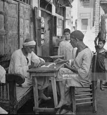
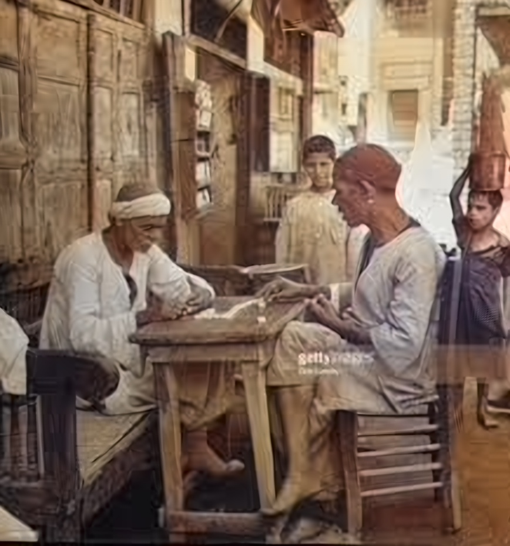
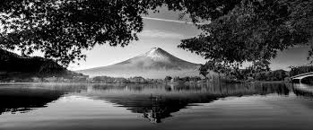
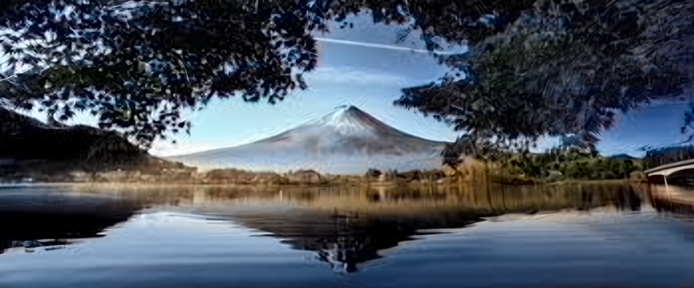

# 🎨 Image Colorization & Super-Resolution Dashboard

This project demonstrates an advanced AI pipeline for restoring and enhancing images. It combines **Deep Learning-based Colorization** to turn black-and-white photos into realistic colored versions and **Super-Resolution (SR)** to upscale and sharpen image details.

---

## 🖼️ Visual Results (Before & After)

Below are the samples showing the transformation process from original grayscale to high-quality colorized results.

### 1. The Lion (Wildlife)
<table>
  <tr>
    <td><b>Original (B&W)</b></td>
    <td><b>Colorized & Enhanced</b></td>
  </tr>
  <tr>
    <td></td>
    <td></td>
  </tr>
</table>

### 2. Traditional Play
<table>
  <tr>
    <td><b>Original (B&W)</b></td>
    <td><b>Colorized & Enhanced</b></td>
  </tr>
  <tr>
    <td></td>
    <td></td>
  </tr>
</table>

### 3. Sea View
<table>
  <tr>
    <td><b>Original (B&W)</b></td>
    <td><b>Colorized & Enhanced</b></td>
  </tr>
  <tr>
    <td></td>
    <td></td>
  </tr>
</table>

---

## 🛠️ Technical Stack & Models

### 1. Image Colorization
Uses a **Caffe-based Deep Learning model** that predicts the `a` and `b` channels of the Lab color space from the grayscale `L` channel.
- **Config:** `colorization_deploy_v2.prototxt`
- **Model Weights:** [Download colorization_release_v2.caffemodel](https://eecs.berkeley.edu/~rich.zhang/projects/colorization/models/v2/colorization_release_v2.caffemodel) *(Required)*
- **Kernel Data:** `pts_in_hull.npy`

### 2. Super-Resolution (SR)
Uses the **EDSR (Enhanced Deep Residual Networks)** model to upscale images by 4x while maintaining sharp edges and textures.
- **Model:** `EDSR_x4.pb`

---

## 🚀 How to Use
1. **Clone the Repo:** Download all files to your local machine.
2. **Download Model Weights:** Since the `.caffemodel` file is large (>100MB), download it from the link provided in the Technical Stack section and place it in the project root.
3. **Run Notebook:** Open `BlackWhiteToRGB.ipynb` in VS Code or Jupyter Notebook.
4. **Process:** Run all cells to see the results for the sample images or upload your own!

---

## 👨‍💻 Project Details
- **Course:** Digital Image Processing.
- **Student:** **Abeer Aun**
---
